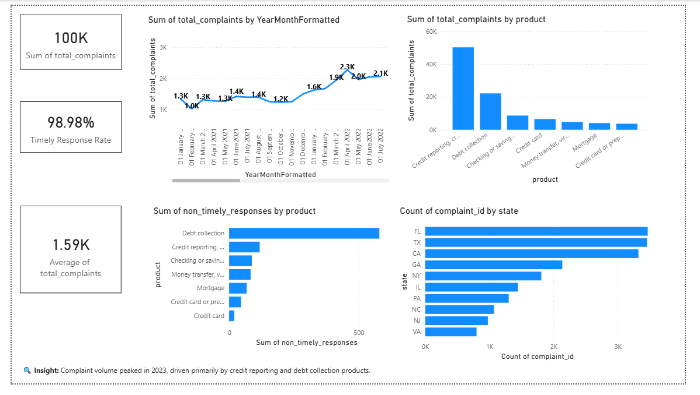
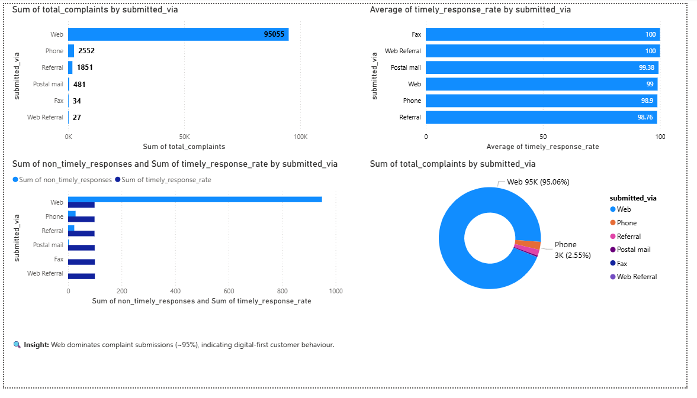
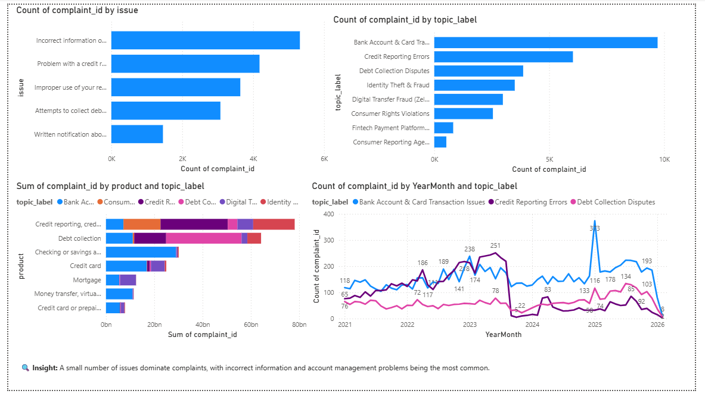

# 🚀 Complaint Intelligence Dashboard
End-to-end Business Intelligence project transforming customer complaint data into actionable insights using Python, SQL, and Power BI.

---

## 🚀 Quick Summary

This dashboard answers a critical business question:  
**What are the main drivers of customer complaints, and where should companies focus to improve customer satisfaction and operational performance?**

It provides a high-level view of complaint trends, identifies root causes using NLP, and highlights product, company, and channel-level risks.

---

## 📊 Project Overview

Customer complaints are a critical source of insight for financial institutions, but analysing large volumes of unstructured complaint data is challenging.

This project builds an **end-to-end Complaint Intelligence Platform** that transforms raw complaint data into actionable business insights using **Python, SQL, and Power BI**.

The solution enables organisations to:
- Identify key complaint drivers
- Monitor trends over time
- Evaluate company performance
- Improve customer experience and operational efficiency

---

## 🔄 How to Reproduce

1. Download the full dataset from the official CFPB website  
2. Run the Python notebooks for data cleaning and NLP analysis  
3. Execute SQL scripts to create tables and analytical views  
4. Open the Power BI dashboard file to explore insights  

---

## 📌 Requirements

- Python (Pandas, NLP libraries)
- MySQL
- Power BI Desktop

---

## 🎯 Business Problem

Financial institutions receive thousands of customer complaints across different products and channels.

However:
- Complaint data is **large and unstructured**
- Root causes are difficult to identify
- Trends and performance issues are not easily visible

👉 This leads to:
- Poor decision-making  
- Slow response to customer issues  
- Operational inefficiencies  

---

## 💡 Solution

To address this, I developed a **Complaint Intelligence Platform** that:

1. Cleans and processes large-scale complaint data  
2. Applies **NLP techniques** to extract key complaint topics  
3. Uses **SQL-based data modelling** for efficient aggregation  
4. Builds **interactive Power BI dashboards** for business insights  

---

## 🛠️ Tech Stack

- **Python** (Pandas, NLP)
- **SQL (MySQL)** for data transformation and aggregation
- **Power BI** for interactive dashboards and visualization

---

## ⚙️ Methodology

### 🔹 1. Data Processing (Python)
- Processed large-scale complaint data using efficient data handling techniques
- Cleaned and standardised fields (dates, categories, text)
- Removed missing values and inconsistencies

---

### 🔹 2. NLP Analysis
- Preprocessed complaint narratives (tokenization, stopword removal, normalization)
- Applied **topic modelling** to identify common complaint themes
- Transformed unstructured text into structured insights for analysis

---

### 🔹 3. SQL Data Modelling
- Designed structured schemas for efficient querying
- Built SQL analytical views for:
  - Monthly complaint KPIs  
  - Product and issue summaries  
  - Company performance metrics  
  - Channel analysis  

---

### 🔹 4. Power BI Dashboard
- Developed a multi-page interactive dashboard:
  - Executive Overview  
  - Product & Issue Analysis  
  - Company Performance  
  - Channel & Customer Analysis  

- Created an **Executive Dashboard** for high-level decision-making
- Designed drill-down visuals for deeper analysis

---

## 📸 Dashboard Preview

### 🔹 Executive Dashboard


### 🔹 Executive Overview



### 🔹 Product & Issue Analysis


### 🔹 Channel & customer Analysis



### 🔹 Company performance Analysis


---

## 🔍 Key Insights

- 📊 Complaint volume peaked in 2023 and declined afterwards  
- ⚠️ Credit reporting and debt collection are major complaint drivers  
- 🏢 A few companies contribute disproportionately to total complaints  
- 🌐 Majority of complaints are submitted via web channels  
- ⏱️ Timely response rates are high (~99%), but some channels lag  

These insights help prioritise operational improvements and risk management.

---

## 📂 Dataset

Due to the large size of the dataset (~8GB), the full dataset is not included in this repository.

### 📌 Sample Dataset
A cleaned sample dataset is provided:
data/complaints_sample.csv

---

### Full Dataset (Official Source)
You can download the full dataset from the official CFPB Consumer Complaint Database here:

[CFPB Consumer Complaint Database](https://www.consumerfinance.gov/data-research/consumer-complaints/)

---

## Project Structure

```text
complaint-intelligence-dashboard/
│
├── data/
│   └── processed/
│       └── complaints_sample.csv
├── notebooks/
│   ├── data_cleaning.ipynb
│   └── nlp_analysis.ipynb
├── sql/
│   ├── schema.sql
│   └── views.sql
├── dashboards/
│   └── Executive_dashboard.pbix
├── images/
│   ├── dashboard_overview.png
│   ├── product_issue_analysis.png
│   ├── company_performance_analysis.png
│   └── channel_customer_analysis.png
├── README.md
└── requirements.txt
```
---

## 📈 Business Impact

This project enables businesses to:

- Identify high-risk products driving customer complaints  
- Detect recurring complaint themes using NLP  
- Monitor company performance and response efficiency  
- Improve customer satisfaction by targeting key issues  
- Optimise support channels based on customer behaviour  

💡 Example Insight:
Debt collection and credit reporting issues contribute the highest complaints, indicating a need for improved transparency and dispute handling.

---

## 🧠 Skills Demonstrated

- Data Analysis  
- SQL (Joins, Aggregations, Views)  
- Python (Pandas, NLP)  
- Topic Modelling  
- Data Visualisation (Power BI)  
- Business Intelligence  
- Problem Solving  
- Stakeholder Reporting

---

## 📌 Future Improvements

- Real-time data pipeline integration  
- Automated reporting dashboards  
- Deployment to cloud platforms  

---


---

## 👨‍💻 Author

**Ujjwal Rastogi**  
MSc Business Analytics — University of Greenwich (Merit, 2026)< br / >
London, UK< br / >
LinkedIn: linkedin.com/in/ujjwal-rastogi-3932a6150< br / >
Email: ujjwal.rastogi260@gmail.com  < br / >

---
