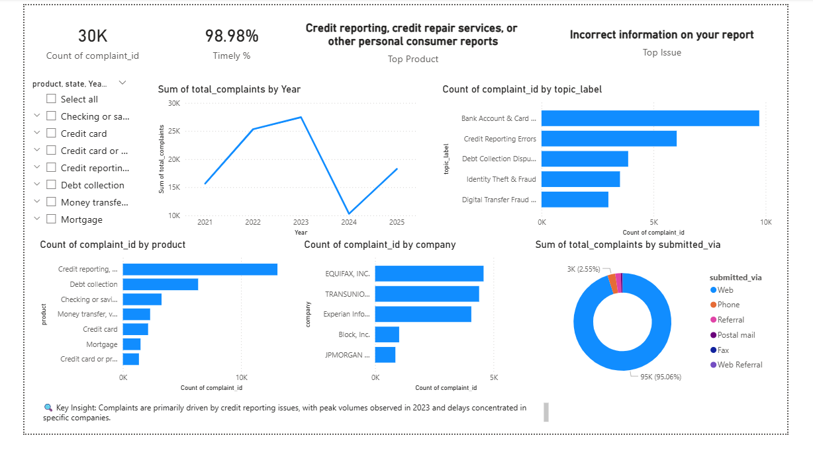

# 🚀 Complaint Intelligence Dashboard
End-to-end Complaint Intelligence Platform using Python, SQL, and Power BI

## 📊 Project Overview

Customer complaints are a critical source of insight for financial institutions, but analysing large volumes of unstructured complaint data is challenging.

This project builds an **end-to-end Complaint Intelligence Platform** that transforms raw complaint data into actionable business insights using **Python, SQL, and Power BI**.

The solution enables organisations to:
- Identify key complaint drivers
- Monitor trends over time
- Evaluate company performance
- Improve customer experience and operational efficiency

---

## 🎯 Business Problem

Financial institutions receive thousands of customer complaints across different products and channels.

However:
- Complaint data is **large and unstructured**
- Root causes are difficult to identify
- Trends and performance issues are not easily visible

👉 This leads to:
- Poor decision-making  
- Slow response to customer issues  
- Operational inefficiencies  

---

## 💡 Solution

To address this, I developed a **Complaint Intelligence Platform** that:

1. Cleans and processes large-scale complaint data  
2. Applies **NLP techniques** to extract key complaint topics  
3. Uses **SQL-based data modelling** for efficient aggregation  
4. Builds **interactive Power BI dashboards** for business insights  

---

## 🛠️ Tech Stack

- **Python** (Pandas, NLP)
- **SQL (MySQL)** for data transformation and aggregation
- **Power BI** for interactive dashboards and visualization

---

## ⚙️ Methodology

### 🔹 1. Data Processing (Python)
- Handled large datasets using efficient data processing techniques
- Cleaned and standardised fields (dates, categories, text)
- Removed inconsistencies and missing values

---

### 🔹 2. NLP Analysis
- Processed complaint narratives (text data)
- Applied text cleaning (stopwords removal, normalization)
- Extracted key themes using **topic modelling**
- Converted unstructured data into structured insights

---

### 🔹 3. SQL Data Modelling
- Created structured tables and optimized schemas
- Built analytical views for:
  - Complaint trends
  - Product performance
  - Company performance
  - Channel analysis

---

### 🔹 4. Power BI Dashboard
- Designed a **multi-page interactive dashboard**:
  - Executive Overview
  - Product & Issue Analysis
  - Company Performance Analysis
  - Channel & Customer Analysis

- Built a final **Executive Dashboard** summarizing:
  - Trends  
  - Root causes  
  - Risk areas  
  - Performance metrics  

---

## 📊 Key Insights

- Credit reporting and debt collection generate the highest complaints  
- Incorrect information is the most common issue  
- Complaint volume peaked around 2023  
- Web is the dominant complaint submission channel  
- Some companies show delayed response patterns  

---

## 📸 Dashboard Preview

### 🔹 Executive Dashboard


---

## 📂 Dataset

Due to the large size of the dataset (~8GB), the full dataset is not included in this repository.

### 📌 Sample Dataset
A cleaned sample dataset is provided:
data/complaints_sample.csv

---

### Full Dataset (Official Source)
You can download the full dataset from the official CFPB Consumer Complaint Database here:

[CFPB Consumer Complaint Database](https://www.consumerfinance.gov/data-research/consumer-complaints/)

---

## Project Structure

```text
complaint-intelligence-dashboard/
│
├── data/
│   └── processed/
│       └── complaints_sample.csv
├── notebooks/
│   ├── data_cleaning.ipynb
│   └── nlp_analysis.ipynb
├── sql/
│   ├── schema.sql
│   └── views.sql
├── dashboards/
│   └── dashboard.pbix
├── images/
│   ├── dashboard_overview.png
│   ├── product_issue_analysis.png
│   ├── company_performance_analysis.png
│   └── channel_customer_analysis.png
├── README.md
└── requirements.txt
```
---

## 🚀 Business Value

This project enables organisations to:

- Identify root causes of complaints  
- Monitor operational performance  
- Improve customer satisfaction  
- Make data-driven business decisions  

---

## 🧠 Key Skills Demonstrated

- Data Cleaning & Preprocessing  
- NLP & Text Analytics  
- SQL Data Modelling  
- Data Visualization & Storytelling  
- Business Problem Solving  

---

## 📌 Future Improvements

- Real-time data pipeline integration  
- Automated reporting dashboards  
- Deployment to cloud platforms  

---

## 👨‍💻 Author

**Ujjwal**  
MSc Business Analytics (UK)  

---
